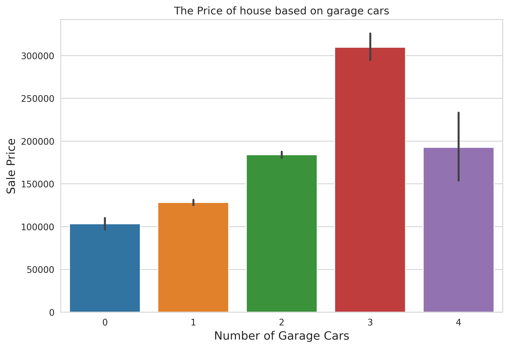
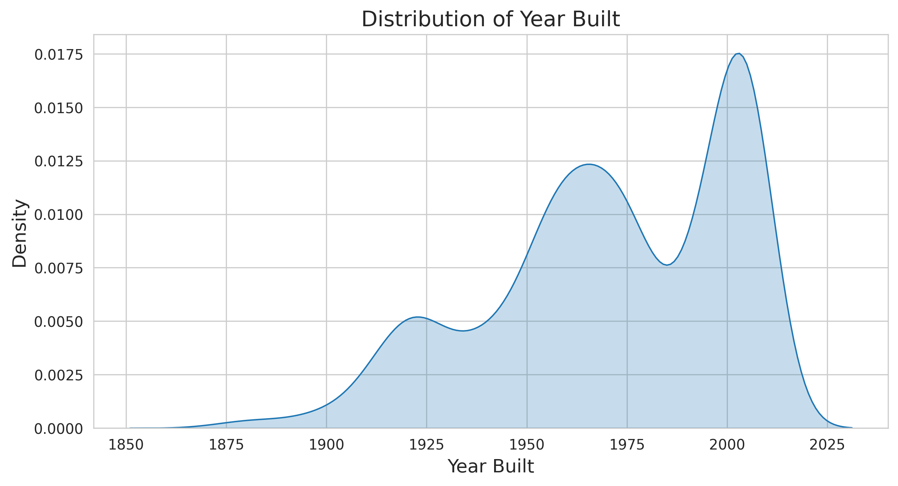
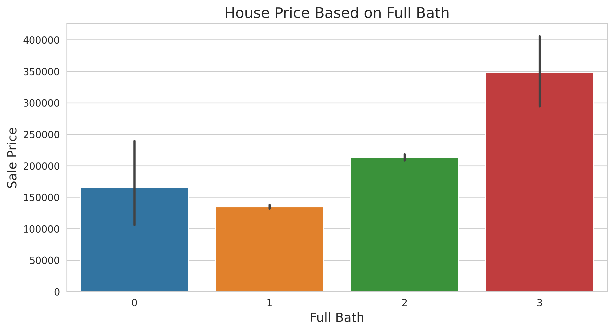

# House Price Prediction Analysis (On Progress)

## Table of Content

-[Background](#background)

-[Objective](#objective)

-[Limitation](#limitation)

-[Data Source](#data-sources)

-[Tools](#tools)

-[Exploration Data Analysis](#exploration-data-analysis-eda)

-[Feature Engineering](#feature-engineering)

-[Machine Learning Result](#machine-learning-result)

-[Conclusion](#conclusion)

-[Reference](#references)

-[Appendix A: Feature Explanation](#appendix-a-feature-explanation)

-[Appendix B: Visualization](#appendix-b-visualization)

-[Appendix C: Build a machine learning](#-appendix-c-build-a-machine-learning)

---


## Background

The house price prediction data provied in order to give insight to client and real estate business owners. By considering a few of house features, we look for the suitable price of several houses for prospective homeowner, especially in Iowa. The price of some houses in the real estate had been labeled. However, a few  of them with almost identical features do not yet have fixed price. So, the owners need data scientist's help to determine the tariff.

## Objective
The goal of this project:

1. The accuration of machine learning predict the price of the rest of the house

2. Rumah seperti apa yang ada di Iowa Real Estate.

3. Range harga rumah di Iowa Real Estate

## Data Sources

The original dataset was published on the Ames Housing Price website, which has since gone offline for unknown reasons—making the exact release date unavailable. Fortunately, a Kaggle user reintroduced the dataset as part of a competition on the platform in 2016. The dataset contains approximately 90 columns and 1,500 entries. For our analysis, we selected 89 features along with one target variable.

## Tools

The list of tools or libraries I used in this project:

- Scikit Learn Ver.

- Seaborn Ver. 

- Matplotlib Ver.

- Pandas Ver. 

## Exploration Data Analysis (EDA)

### Feature Selection

Because there are quite a lot of features in this dataset, filtering needs to be done using feature selection.

<p align = 'center'>

</p>

- Gambar diatas merupakan hasil dari feature selection. Berdasarkan hasil dari proses filter ini, didapatkan beberapa fitur yang memiliki skor korelasi `pearson` yang kuat terhadap harga rumah yang diwakilkan oleh kolom **SalePrice** seperti kualitas secara keseluruhan (**OverallQual**), luas area tempat tiggal(**GrLivArea**), number of cars garage (**GarageCars**), luas tanah untuk garasi mobil (**GarageArea**), ..(**TotalBsmtSF**), ...(**1stFlrSF**), ...(**FullBath**), ....(**TotRmsAbvGrd**), ...(**YearBuilt**), and Tahun Rumah setelah Remodelling(**YearRemodAdd**). Proyek kali ini akan meninjau rumah dari dua sisi, segi harga dan ketersediaan.

### House Price based on Overall Quality

<p align = 'center'>

</p>

- The scale of the quality (**OverallQual**) of the house ranges from 1 to 10. The higher the score, the better the house. Based on the image above, we can clearly see that the overall quality of the house determines its price. The better the quality of the house, the more expensive it is.

<p align = 'center'>

</p>

- However, the majority of homes for sale in the Iowa area are, in terms of quality, mediocre. If we look at the price of a home based on overall quality, it can be concluded that the prices of homes there are quite affordable.

### House Price based on The Living Area above Ground Level (in square feet)

Some of the images below are regression plots. Simply put, the way to read a regression plot is to look at the straight, solid blue line displayed between the scatterplots. There are two regression line slopes:
     
 1. If it is the upward-sloping line, then the figure show positive correlation between dependent (y-axis) and independent variables (x-axis).
     
 2. If it shows the downward-sloping line, the figure illustrates negative correlation between axes.

<p align = 'center'>

</p>

- TThe figure above illustrates a *positive correlation* between above-grade living area and house price. It suggests that larger living spaces generally correspond to higher property values. Most homes listed for sale in Iowa fall within the $50,000 to $350,000 price range and offer living areas between 500 and 3,000 square feet.

<p align = 'center'>

</p>

- The distribution plot indicates that most properties listed for sale have above-grade living areas ranging between 500  and 3,000 square feet (approximately 46 $m^2$ and 278 $m^2$).

### House Price based on the Number of Garage Cars

<p align = 'center'>

</p>

- According to the figure above, the number of garage spaces is a significant factor affecting house prices. Homes with three-car garages have the highest average price in the Iowa housing market.

<p align = 'center'>

</p>

- However, the countplot above shows that homes with two garages are significantly more common than those with three-car garages. This trend may reflect the community’s preference for homes that offer ample space without exceeding practical needs.

### House Price based on Area of the Garage

<p align = 'center'>

</p>

- The regression plot illustrates the relationship between home prices (**SalePrice**) and garage area (**GarageArea**), with red shading highlighting regions of high data density. It reveals that most homes in the Iowa real estate market feature garage areas ranging from 180 to 800 square feet and are typically priced between $80,000 and $300,000.


<p align = 'center'>

</p>

- When viewed from a density plot perspective, homes with garages ranging from 230 to 780 square feet are the most widely available product at Iowa Real Estate.

### House Price based on Total Basement Area (in square feet)

<p align = 'center'>

</p>

- The figure above shows the distribution plot between the independent variable Total Basement Area (**TotalBsmtSF** ) and the dependent variable, **SalePrice**. From the figure, we can find out the average area of ​​the basements of houses available in Iowa and their prices. The area of ​​the most widely available basements ranges from 100 to 2000 square feet with prices ranging from $50,000 to $380,000.

### House Price based on the Area of First Floor (in Square Feet)

<p align = center>

</p>

- The **1stFlrSf** column denotes as how wide the first floor of the house is. The Figure above shows that most of the houses have a first floor with an area range of 500 to 2500 square feet with a price of $ 50,000 to $ 400,000. Moreover, the linear regression plot above indicates that the wider the first floor of the house, the higher the price of the house.

### House Price based on its Construction Date

<p align = center>

</p>

- The **YearBuilt** column contains the year the home was built. The majority of homes for sale in Iowa were built between 1910 and 2010 and are priced between $100,000 and $400,000.

<p align = center>

</p>

- The density plot above shows that most of the housing in Iowa was built between 1910-2010.

### House Price based on Number of Full Bathrooms above Grade 

<p align = center>

</p>

- The term **FullBath** refers to the completeness of bathroom amenities, typically including a toilet, sink, bathtub, and shower. Homes that feature three bathroom fixtures generally command higher prices than those with fewer. Interestingly, homes lacking any bathroom fixtures are slightly more expensive than those with just one

<p align = center>

</p>

- In terms of availability, houses with one or two bathroom features are more common than those with three. Additionally, properties without any bathroom features are extremely rare.

### House Price based on the Total Living Room above Grade

<p align = center>

</p>

- From the analysis results, the house price **SalePrice** relative to the number of rooms above ground level (grade) **TotRmsAbvGrd** shows an increase in house prices along with the number of rooms above ground level. Surprisingly, the price of a house with 12 and 14 rooms is cheaper than a house with 10 and 11 rooms.

<p align = center>

</p>

- However, in terms of supply, the majority of homes for sale have five to seven total rooms, suggesting that demand for other room counts is relatively lower. Moreover, we can answer the cause of the anomaly in the previous image that the need for houses with 10 and 11 rooms is higher demand when compared to those with 12 and 14 rooms.

### House Price based on the Year Remodelled

 The **YearRemodAdd** is a data feature that contains the date the house was remodeled. By definition, remodeling and renovation are different things. *Renovation* is the process of minor improving part without alter the appearance of the house structure, while *Remodel* is a process that involves significant changes to the house including its space, structure, layout, and function. _The remodel date will be considered the construction date if there are no additions or remodels_.

<p align = center>

</p>

- The image above shows the price of a house based on the date of the house remodeling. Remodeling a house can cause the price of the house to increase. The younger the house, the more expensive it is.


<p align = center>

</p>

- Most homes in Iowa were renovated around the 2000s, marking a period of modernization that introduced updated layouts and amenities.

### Categorical Variables

This subchapter focuses on categorical variables—features represented by string data types. To assess their relationship with the target variable SalePrice, the project employs p-values as a statistical measure of significance. In essence, the p-value indicates whether a feature has a meaningful effect, evaluated according to two main criteria:

1. If the p-value is less than 0.05, we consider the feature to be statistically significant, and the null hypothesis ($H_0$)—which assumes no effect or no difference—is rejected.

2. Otherwise, if the p-value is **more than 0.05**, teh feature to be insigificant, and the null hypothesis is accepted.

TThe hypothesis $H_0$, known as the null hypothesis, assumes that there is no significant difference or effect between the variables being studied. To evaluate the impact of categorical features on a numeric target variable (such as SalePrice), we apply the ANOVA (Analysis of Variance) method.

<p align = center>

</p>

- Berdasarkan hasil ekplorasi, terdapat lima fitur kategorik, berdasarkan p-value,  yang dianggap tidak memiliki signifikansi terhadap harga rumah. Maka dari itu, beberapa fitur yang tidak insignifikan terhadap model perlu dihapus.

## Feature Engineering

Pembahasan di subbab ini meliputi permasalahan yang ada di dalam data seperti null value, skewness, dan duplication. 

### Null Value

<p align = center>

</p>

- The dataset contains a substantial number of missing values overall. However, a closer inspection reveals that only a few features have more than 5% null entries. These features will be excluded from the analysis due to their minimal contribution to model performance, while the remaining missing values will be addressed using imputation techniques.

### Skewness

Skewness is an indicator of how symmetric a data distribution is. This project uses Pearson's first and second equations. The range of scores that categorizes the data distribution for a given feature as symmetric is -0.5 to 0.5.

<p align = center>

</p>

- The image above shows the results of a skewness score analysis for all features. Some features, such as **MiscVal**, **PoolArea**, and **LotArea**, have quite high skewness scores, indicating that the data distribution in these features is asymmetric. This can interfere with model predictions and requires removal or other methods such as Log Transformation.


### Duplication

This dataset does not have duplicated data.

## Machine Learning Result

 This project used several regression models, including linear, lasso, ridge, elastic, and XGBoost. However, upon closer inspection, the lasso and XGBoost models provided good predictions, as indicated by the lowest Root Mean Squared Error (RMSE) scores. Therefore, the two models were combined using an ensemble method. The results of both models are discussed in this subchapter.

### XGBoost

<p align = center>

</p>

- The image illustrates RMSE scores under the parameter setting boost_round = 500 in XGBoost, which aims to enhance prediction accuracy by iteratively correcting previous errors. On the training dataset, RMSE continues to decrease as the number of boosting rounds increases, indicating room for further improvement. However, the trend differs for the test dataset: despite a brief decline in error, the model reaches a saturation point at boost_round = 100, with a minimum RMSE of approximately 0.13.

### LassoCV

<p align = center>

</p>

- The `alphas` parameter on the Lasso regression model represents the range of regularization strengths evaluated through cross-validation. The model selects the alpha that minimizes prediction error by penalizing less informative features. According to the figure above, increasing the regularization strength beyond a certain point does not improve performance—in fact, it may worsen it by overly constraining the model.

<p align = center>

</p>

- The coefficient in a regression represents how much a feature influences the model's prediction results. According to the image above, the feature with the highest coefficient value is the living area above grade (**GrLivArea**), while the feature with the smallest coefficient value is the zone where the house is built (**MSZoning**).

### Ensemble Technique

Weighted averaging in machine learning is a method where predictions from two or more models are combined, and each model's influence on the final result is controlled by a weight. These weights reflect how much we trust each model’s prediction. 

<p align = center>

</p>

- The figure above illustrates diagnostic check between XGBRegression model and LassoCV model. According to the picture, both models are in sync. The XGB model will be given a weight score of 0.6 and Lasso 0.4.

<p align = center>

</p>

- The image above presents the prediction outcomes from this project. Based on a Kaggle submission to the House Price Prediction: Advanced Regression competition, the model achieved an RMSE score of approximately 0.2—demonstrating a prediction that closely aligns with the actual values.

## Conclusion

After we analyze the data, the result we get:

1. Based on *Root Mean Square Error*, the score we get is around $0.3$. It means that the machine learning is accurate enough to predict the rest of the house price.

2. From the EDA step ([See Appendix B](#appendix-b-visualization)), the majority of the house is built in range of 1800s and 1900s, have 4 rooms (including living room), garage, no pool, and average quality. However, some of the house built in 1900s and 2000s prices is slight expensive. Overall, whenever these houses were built, most of them were sold in fairly good quality.

3. Based on the distribution plot, the range price for most house of Iowa real estate is between $100.000 and $200.000. The homeowner candidate need at least $150.000 to purchase the average house (not including tax or another additional bill).   

### Recommendation

Based on the analysis, we recommend that:

1. The cost of the unlabeled houses is not far from the price-labeled ones, hence the clients do not worry about it and feel free to choose.

2. For the people who wants to live in a simple, comfotable, and affordable home, Iowa real estate provides it. Moreover, most of them are liveable even the home is quite old (referring to the year it was built).

3. Before purchase the house in Iowa, ask yourself and your family what kind of house you need to stay, what is the most important house feature do you need, the number of family do you bring to stay together, and so on. It filters what kind of house do you want to have.   

### Limitation

Unfortunately, the things you need to consider about this project:

1. The provided data is the list of houseprice in Iowa real estate in 2016, so it is unreliable information if you need the houseprice information in the other state or place. Moreover, the price of the house nowadays is rising up due to the inflation.

2. The data still have numerous outliers and zero values even after preprocessing step.

3. A few features with continous value is not well-distributed (skewed), so it affect to the prediction model.

### References

- [Anna Montoya, DataCanary. (2016). House Prices - Advanced Regression Techniques.](https://www.kaggle.com/competitions/house-prices-advanced-regression-techniques)

- [Bureau Labor Statistics: County Employment and Wages in Iowa - Second Quarter 2016](https://www.bls.gov/regions/midwest/news-release/2016/pdf/countyemploymentandwages_iowa_20161230.pdf)

### Appendix A: Feature Explanation

First, we used a correlation to filter what the most influence feature of the house to the Sale Price.

``` python
#Exploratory data analysis (feature selection)
k = 11
plt.figure(figsize = (12,9))
num_cols = df_train.select_dtypes(exclude = ['object'])
cols = num_cols.corr(method = 'pearson').nlargest(k, 'SalePrice')['SalePrice'].index
cm = np.corrcoef(num_cols[cols].values.T)
sns.set(font_scale = 0.87)
hm = sns.heatmap(cm, cbar = True, square = True, annot = True, fmt = '.2f', xticklabels = cols.values, yticklabels = cols.values)
plt.title('Highest Correlation of House Price')
plt.savefig('highest_corr_features.jpg')

```


The table below show a short description of highest correlation feature.

|No|Feature|Description|
|--|--|--|
|1|SalePrice|The Price of the house|
|2|OveralQuall|Overall material and finish quality|
|3|GrLivArea|Above grade (ground) living area square feet|
|4|GarageCars|Size of garage in car capacity|
|5|GarageArea|Size of garage in square feet|
|6|TotalBsmtSF|Total square feet of basement area in square feet|
|7|1stFlrSF|First Floor square feet|
|8|FullBath| Full bathrooms above grade (ground)|
|9|TotRmsAbvGrd|Total rooms above grade (does not include bathrooms)|
|10|YearBuilt|Original construction date in Year|
|11|YearRemodAdd|Remodel date in Year|

### Appendix B: Visualization

```python
#SalePrice vs Yearbuild
fig = plt.figure(figsize = (12,9))
p = sns.jointplot(data = df_train, x = df_train['YearBuilt'], y= df_train['SalePrice'], kind = 'hex')
p.fig.suptitle('House price vs year built')
fig.tight_layout()
plt.savefig('Distribution Plot of YearBuilt-SalePrice.jpg')
```


```python
#Quality of the house and its cost 
plt.figure(figsize = (10,5))
sns.barplot(data = df_train, x = 'OverallQual', y = 'SalePrice')
plt.title('House Price Based on Quality')
plt.savefig('Quality Saleprice Barplot.jpg')
```


```python
#Counting the house based on the quality
sns.countplot(df_train, x = df_train['OverallQual'])
plt.title('Quality of the house')
plt.savefig('overallquality_house', dpi = 200)
```


```python
# House SalePrice Distribution
#Gaussian Distribution of SalePrice
from scipy import stats
from scipy.stats import norm

sns.histplot(df_train['SalePrice'], kde = True, stat = 'density')
plt.savefig('densityplot', dpi=200)
```


```python
#Garage Area Density plot and the countplot of Garage Cars in Iowa Real Estate
fig, axs = plt.subplots(1,2, figsize = (10,6))

df_train['GarageArea'].plot(kind = 'density', ax = axs[0], xlabel = 'GarageArea', title = 'Distribution of Garage Area', fontsize = 8)
sns.countplot(data = df_train, x = df_train['GarageCars'], ax = axs[1])
fig.tight_layout()
plt.savefig('garagecars_area', dpi = 200)

```

### Appendix C: Build a machine learning


```python

```

